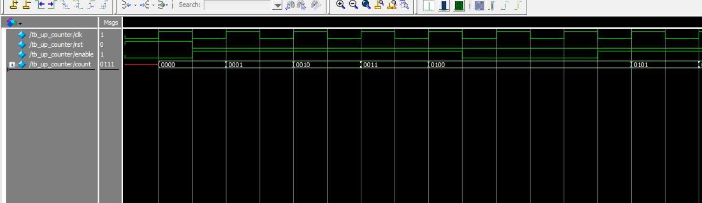

# 🔢 DFT Practice — 4-bit Up Counter (Verilog RTL + ModelSim)

This is a practice project for DFT and RTL development.  
It includes a 4-bit up counter written in Verilog, verified with a ModelSim testbench, and visualized using Quartus RTL Viewer.

---

## 📁 Files

| File | Description |
|------|-------------|
| `up_counter.v` | Verilog RTL for 4-bit up counter |
| `tb_up_counter.v` | Verilog testbench for simulation |
| `wave_tb_up_counter.bmp` | Waveform from ModelSim simulation |
| `RTL_up_counter.pdf` | RTL schematic from Quartus Prime |

---

## 📐 RTL Schematic

> RTL logic generated by Quartus Prime

📎 [View RTL Diagram (PDF)](RTL_up_counter.pdf)

---

## 📊 Simulation Waveform

> - Counter increments when `enable = 1`
> - Reset (`rst`) initializes the counter to `0000`



---

## 🧪 Simulation (ModelSim commands)

```tcl
vlib work
vlog up_counter.v
vlog tb_up_counter.v
vsim tb_up_counter
add wave *
run 100ns
🛠️ Toolchain
Verilog HDL

ModelSim Intel FPGA Starter Edition 10.5b

Quartus Prime Lite Edition 18.0

✍️ Author
GitHub user: Huichingchang
This is part of a series of RTL + DFT practice projects for job transition and technical strengthening.
