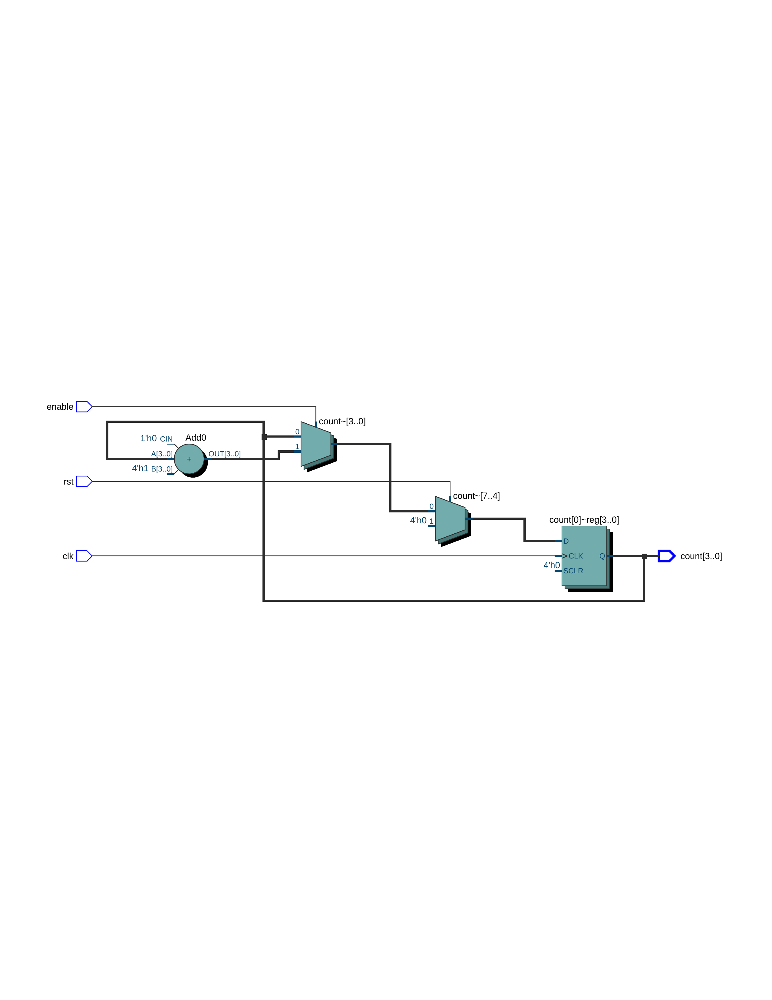

# 🔢 DFT Practice — 4-bit Up Counter (Verilog RTL + ModelSim)

This is a Verilog-based 4-bit up counter with synchronous reset and enable.  
Simulation is done using **ModelSim**, and RTL visualization is done with **Quartus Prime**.

---

## 📁 Project Files Overview

| File | Description |
|------|-------------|
| `up_counter.v` | RTL design: 4-bit up counter with synchronous reset and enable |
| `tb_up_counter.v` | Verilog testbench for simulation |
| `wave_tb_up_counter.png` | **Simulation waveform from ModelSim** |
| `RTL_up_counter.png` | **Quartus RTL Viewer output** |

---

## 🧠 RTL Viewer Output



---

## 🧪 Simulation Result (ModelSim)

> ✅ When `enable=1` and `rst=0`, `count` increments  
> ✅ When `rst=1`, `count` is reset to zero  
> ✅ Clock period = 10ns (50 MHz)


---

## 🛠️ Simulation Steps (ModelSim)

```tcl
vlib work
vlog up_counter.v
vlog tb_up_counter.v
vsim tb_up_counter
add wave *
run 100ns
🔧 Tools Used
Verilog HDL

ModelSim Intel FPGA Starter Edition 10.5b

Quartus Prime Lite Edition 18.0

🙋 Author
GitHub: Huichingchang
This project is part of my RTL/DFT learning journey with hands-on simulation and visualization.
