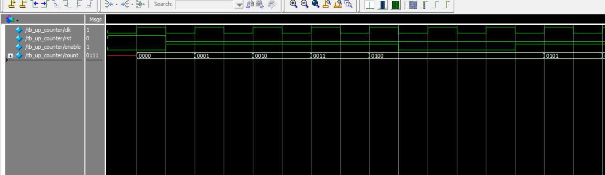

# 🔢 DFT Practice — 4-bit Up Counter (Verilog RTL + ModelSim)

This is a Verilog-based 4-bit up counter with synchronous reset and enable.  
Simulation is done using ModelSim, and the RTL is visualized with Quartus Prime.

---

## 📁 Project Files

| File | Description |
|------|-------------|
| `up_counter.v` | RTL design (4-bit counter with sync reset and enable) |
| `tb_up_counter.v` | Testbench for simulation |
| `wave_tb_up_counter.png` | **ModelSim waveform** (shown below 👇) |
| `RTL_up_counter.pdf` | RTL viewer plot from Quartus |

---

## 🧠 RTL Logic (Quartus RTL Viewer)

📎 [`RTL_up_counter.pdf`](RTL_up_counter.pdf)

---

## 🧪 ModelSim Simulation Waveform

> ✅ Counter increments only when `enable = 1` and `rst = 0`  
> ✅ Reset (`rst = 1`) clears `count` to 0  
> ✅ Result observed over 50 MHz clock (10ns period)



---

## 🔧 ModelSim Simulation Steps

```tcl
vlib work
vlog up_counter.v
vlog tb_up_counter.v
vsim tb_up_counter
add wave *
run 100ns
🛠️ Tools Used
Verilog HDL

ModelSim Intel FPGA Starter Edition 10.5b

Quartus Prime Lite Edition 18.0

🙋 Author
GitHub: Huichingchang
